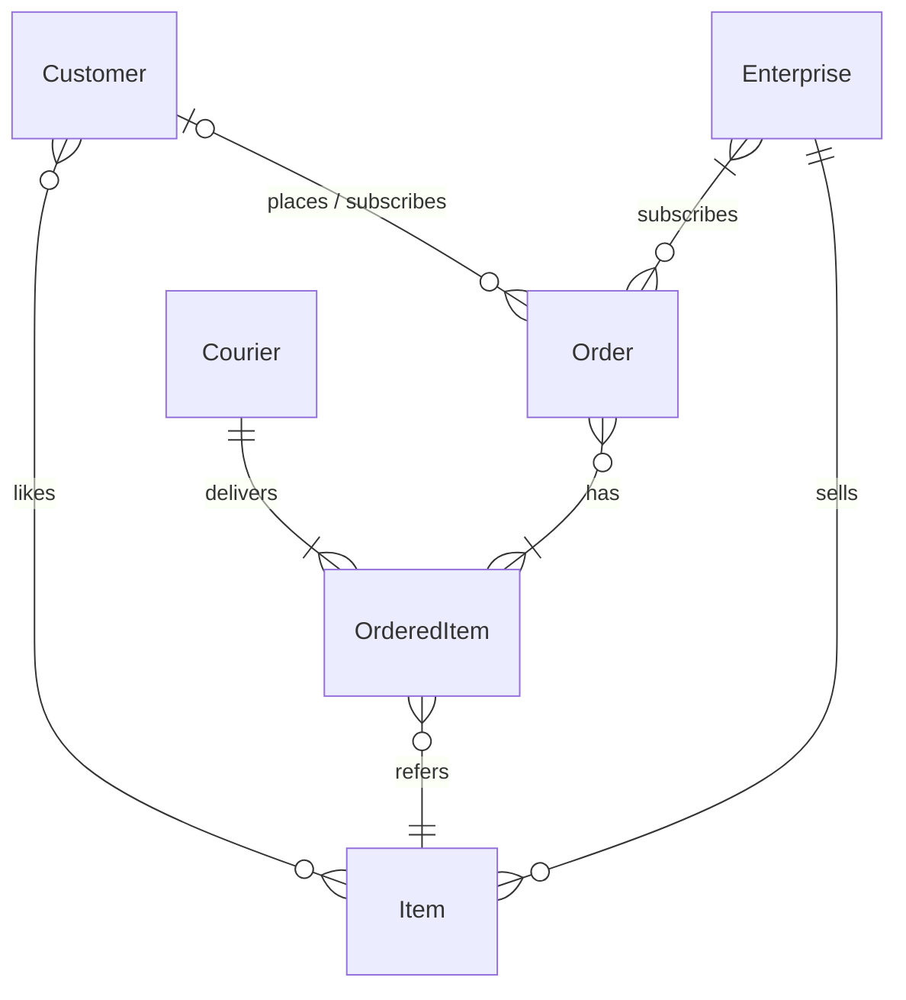
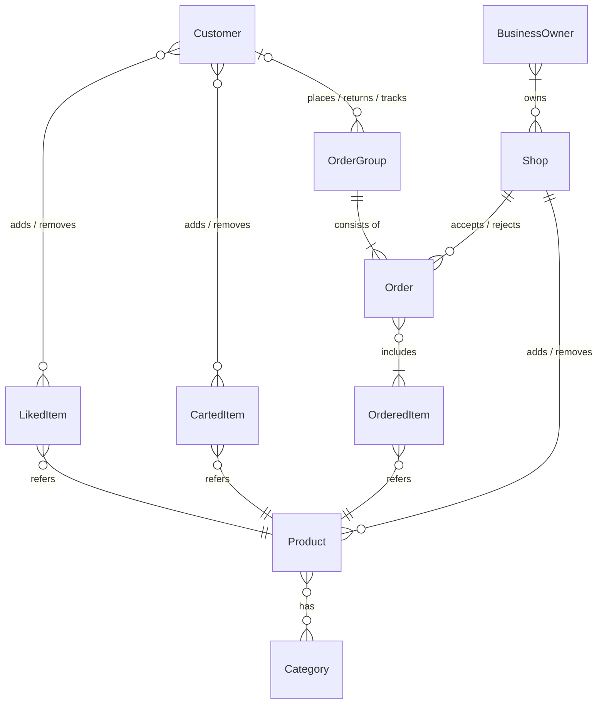

## Basic Database Concept

## Services

- Front-End Server
    - web page server
    - image server
- User
    - Register
    - Favorite (Wishlist)
    - Authorization
        - OAuth
            - Apple
            - Google
            - Facebook
- Recommendation
- Order
    - Placement
    - Track
    - Return
- Payment
    - Cash on Delivery
    - Credit Card
    - PayPal
    - Apple Pay
- Order Relay
    - Order-Courier Matching
    - Customer Side Order Tracking
    - Estimate Delivery Time
- Shop / Shop Owner
    - Add Item
    - Update Item
    - Settlement
    - Accept Order
- Advertisement
- Menu
- Coupon
- Point
- Settlement

## Further more

쟁점:
- 장바구니(CartItem)을 FE에서만 구현할 건지, BE에 의존할 것인지.
- 소요시간을 어떻게 계산할 것인지. 머신러닝에 의존, 단순 알고리즘... 외부 API
    - 배송사의 휴무일?
    - 산간지역?
    - 교통상황?
    - 배송인/배송사의 사정?
    - 특수상황(도난/분실)
- 추천 알고리즘 역시 어떻게 구현할 것인지.
    - 좋아요를 기준
    - 유사 카테고리 아이템 추천
    - 동일 기업의 아이템 추천
- 결제 방법
    - 대행업체 사용?
- 서로 다른 업체의 주문을 처리할 때
    - 픽업하는 기사도 여러 명?
        - 각 기사의 도착을 기준?
        - 마지막 기사의 도착을 기준?
    - 하나의 매장 당 하나의 주문만 처리하게 하는게 옳을 것 같음.

## Extended Database Concept

- Each order is associated to a business owner.
- Items

I really appreciate about the equity you offered but I still prefer to get paid & It will provide me the stable environment to focus on the development.
